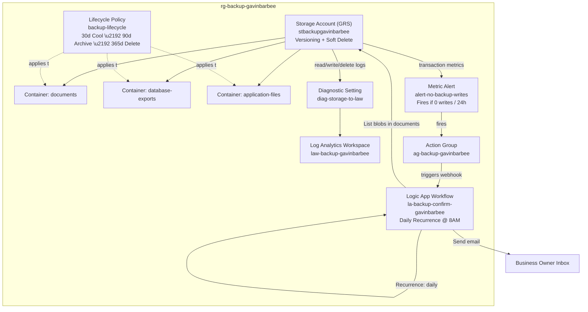
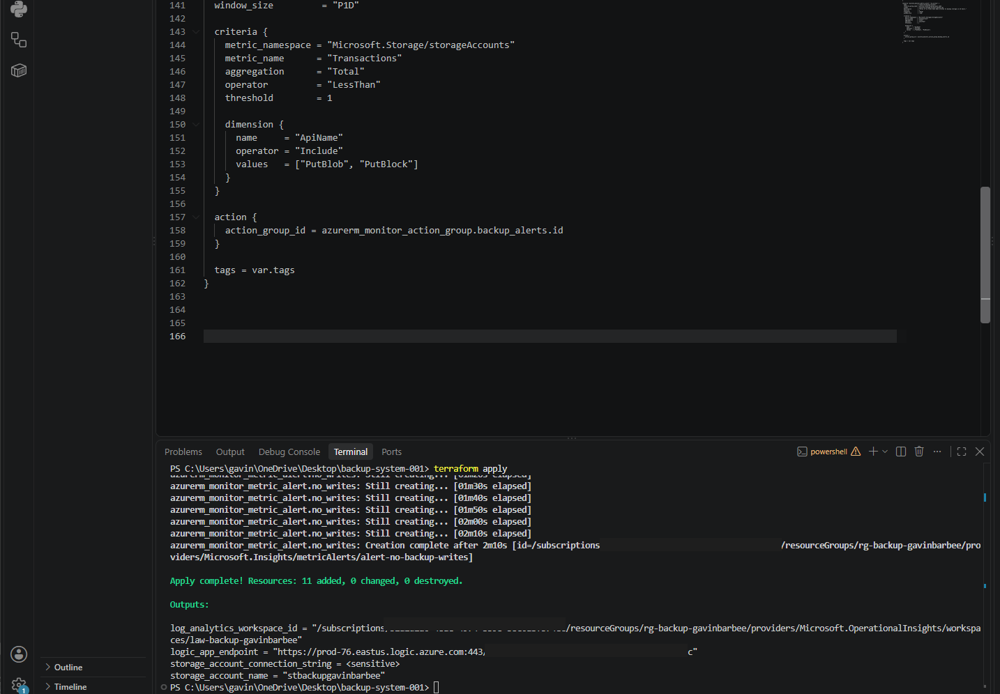
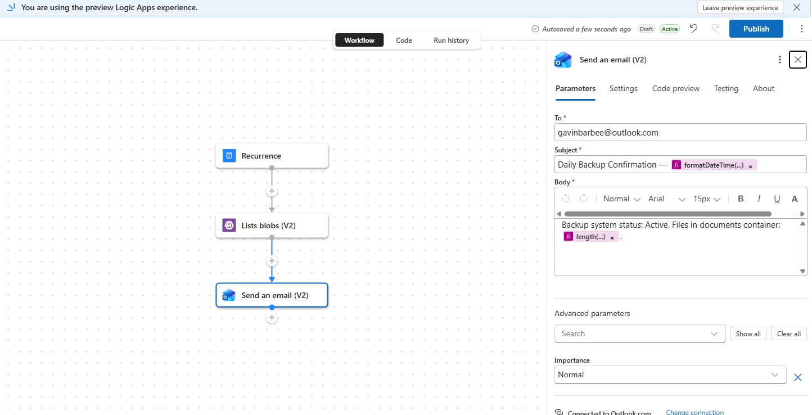
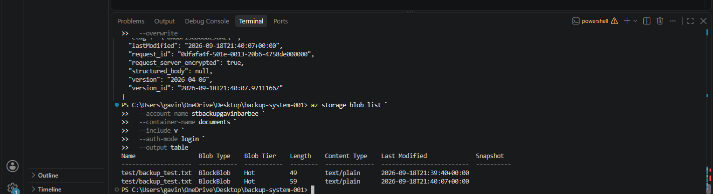
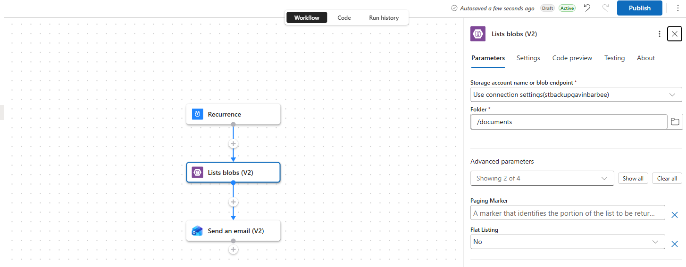

# Azure Automated Backup System

**Status:** ✅ Built, deployed, and verified end-to-end — versioning, lifecycle policy, the no-writes alert, and the daily confirmation email are all live in the subscription.

## 🎬 Video Walkthrough

[](https://www.loom.com/share/2f27979f387447e89cd8f385f0c8e0b4)

---

## 📖 Project Overview

For most small businesses, the backup strategy is someone occasionally copying files to an external drive. When that person is on holiday, busy, or just forgets, nothing gets backed up. When something eventually goes wrong, the data is simply gone.

This project replaces that manual, unreliable process with a system that:
- Automatically replicates every file across multiple Azure data centers the moment it's uploaded
- Keeps every previous version of every file, so anything accidentally deleted or overwritten can be restored
- Automatically moves older files to cheaper storage tiers after 30 days and archives them after 90 days — keeping costs under control without manual intervention
- Sends a confirmation email every morning so the business owner knows the backup system is working without having to check

**Business outcome:** no more lost data, no more manual processes, no more hoping someone remembered.

### Skills Demonstrated
- Infrastructure as Code with Terraform (`azurerm` provider)
- Azure Blob Storage — geo-redundant replication, versioning, soft-delete retention
- Storage lifecycle management — automated tiering (Hot → Cool → Archive) and version cleanup
- Azure Monitor — metric-based alerting on storage transaction activity, diagnostic settings
- Log Analytics — centralized storage read/write/delete audit logging
- Logic Apps — recurrence-triggered workflow automation
- Azure CLI — data-plane operations against blob storage (`az storage blob`)
- Azure RBAC — data-plane role requirements for storage operations

---

## 🏗️ Architecture Diagram



---

## ✅ Prerequisites

> If you completed Project 1, Terraform and the Azure CLI are already installed — skip to [Step 1](#step-1--folder-setup).

**1. Install Terraform**

Download from https://developer.hashicorp.com/terraform/install, extract to `C:\terraform\`, then:

```powershell
[Environment]::SetEnvironmentVariable("PATH", $env:PATH + ";C:\terraform", "User")
terraform --version
```

**2. Install Azure CLI**

Download from https://aka.ms/installazurecliwindows, then:

```powershell
az --version
```

**3. Log in to Azure**

```powershell
az login
az account set --subscription "Azure subscription 1"
az account show
```

---

## 🏷️ Naming Conventions

All resource names use `gavinbarbee` in place of `[yourname]`.

| Resource | Naming Pattern | Example |
|---|---|---|
| Resource Group | `rg-backup-[yourname]` | `rg-backup-gavinbarbee` |
| Storage Account | `stbackup[yourname]` | `stbackupgavinbarbee` |
| Storage Containers | `documents`, `database-exports`, `application-files` | (same) |
| Log Analytics Workspace | `law-backup-[yourname]` | `law-backup-gavinbarbee` |
| Storage Diagnostic Setting | `diag-storage-to-law` | `diag-storage-to-law` |
| Action Group | `ag-backup-[yourname]` | `ag-backup-gavinbarbee` |
| Action Group Short Name | — | `backupalert` |
| Logic App Workflow | `la-backup-confirm-[yourname]` | `la-backup-confirm-gavinbarbee` |
| Monitor Alert Rule | `alert-no-backup-writes` | `alert-no-backup-writes` |
| Lifecycle Policy Rule | `backup-lifecycle` | `backup-lifecycle` |

---

## 🪜 Project Steps

### Step 1 — Folder Setup

```powershell
New-Item -ItemType Directory -Path "$HOME\backup-system-001"
cd "$HOME\backup-system-001"
New-Item -ItemType File main.tf, variables.tf, outputs.tf, terraform.tfvars
```

---

### Step 2 — Write `variables.tf`

```hcl
variable "yourname" {
  description = "Your name, lowercase, no spaces. Used to make resource names unique."
  type        = string
}

variable "location" {
  type    = string
  default = "East US"
}

variable "alert_email" {
  description = "Email address to receive daily backup confirmation."
  type        = string
}

variable "tags" {
  type = map(string)
  default = {
    project     = "backup-system"
    environment = "dev"
    managed_by  = "terraform"
  }
}
```

---

### Step 3 — Write `terraform.tfvars`

```hcl
yourname    = "gavinbarbee"
location    = "East US"
alert_email = "your.email@example.com"
```

> Replace `your.email@example.com` with the email address where you want to receive the daily backup confirmation.

---

### Step 4 — Write `main.tf`

**Provider and data sources**

```hcl
terraform {
  required_providers {
    azurerm = {
      source  = "hashicorp/azurerm"
      version = "~> 3.0"
    }
  }
}

provider "azurerm" {
  features {}
}

data "azurerm_client_config" "current" {}
```

**Resource group**

```hcl
resource "azurerm_resource_group" "main" {
  name     = "rg-backup-${var.yourname}"
  location = var.location
  tags     = var.tags
}
```

**Storage account**

This is the core of the backup system. Every file uploaded here is automatically replicated across multiple physical Azure data centers — not just different rooms in the same building, but geographically separate facilities.

`account_replication_type = "GRS"` stands for Geo-Redundant Storage. Azure keeps data in the primary region (East US) and asynchronously copies it to a secondary region (West US). If an entire region goes offline, the data still exists in the secondary. `min_tls_version = "TLS1_2"` enforces modern TLS on all connections.

`blob_properties` with `versioning_enabled = true` is what makes this a real backup system rather than just a file store — every time a file is overwritten or deleted, Azure keeps the previous version. `delete_retention_policy` with `days = 30` means even a deleted blob is retained in a soft-deleted state for 30 days before permanent removal — a safety net on top of versioning.

```hcl
resource "azurerm_storage_account" "backup" {
  name                     = "stbackup${var.yourname}"
  resource_group_name      = azurerm_resource_group.main.name
  location                 = var.location
  account_tier             = "Standard"
  account_replication_type = "GRS"
  min_tls_version          = "TLS1_2"

  blob_properties {
    versioning_enabled = true

    delete_retention_policy {
      days = 30
    }

    container_delete_retention_policy {
      days = 30
    }
  }

  tags = var.tags
}
```

**Storage containers**

Containers are the top-level organizational unit inside a storage account. Separating data by type matters when you need to restore something under pressure — you don't want to be searching through a mixed pile of files during an incident. `container_access_type = "private"` means no public internet access; files can only be reached by authenticated Azure identities or connection strings.

```hcl
resource "azurerm_storage_container" "documents" {
  name                  = "documents"
  storage_account_name  = azurerm_storage_account.backup.name
  container_access_type = "private"
}

resource "azurerm_storage_container" "database_exports" {
  name                  = "database-exports"
  storage_account_name  = azurerm_storage_account.backup.name
  container_access_type = "private"
}

resource "azurerm_storage_container" "application_files" {
  name                  = "application-files"
  storage_account_name  = azurerm_storage_account.backup.name
  container_access_type = "private"
}
```

**Lifecycle management policy**

This is what keeps backup costs from growing unbounded over time. Azure has four storage tiers — Hot, Cool, Cold, and Archive — each progressively cheaper to store but more expensive to read.

The `base_blob` rule applies to the current (live) version of each file: after 30 days of no modification it moves from Hot to Cool, after 90 days to Archive, and after 365 days it's deleted. The `version` rule applies to superseded versions — kept for 30 days (long enough to catch corruption or accidental deletion) then permanently removed, so old versions don't grow storage costs without limit. `prefix_match` applies the policy across all three containers.

```hcl
resource "azurerm_storage_management_policy" "lifecycle" {
  storage_account_id = azurerm_storage_account.backup.id

  rule {
    name    = "backup-lifecycle"
    enabled = true

    filters {
      blob_types   = ["blockBlob"]
      prefix_match = ["documents/", "database-exports/", "application-files/"]
    }

    actions {
      base_blob {
        tier_to_cool_after_days_since_modification_greater_than    = 30
        tier_to_archive_after_days_since_modification_greater_than = 90
        delete_after_days_since_modification_greater_than          = 365
      }

      version {
        delete_after_days_since_creation = 30
      }
    }
  }
}
```

**Log Analytics Workspace**

```hcl
resource "azurerm_log_analytics_workspace" "main" {
  name                = "law-backup-${var.yourname}"
  location            = var.location
  resource_group_name = azurerm_resource_group.main.name
  sku                 = "PerGB2018"
  retention_in_days   = 30
  tags                = var.tags
}
```

**Storage diagnostic settings**

Routes storage logs and metrics into Log Analytics. `StorageWrite` records every file write — the signal that backups are landing. `StorageRead` and `StorageDelete` record reads and deletions, together giving a complete audit trail. The `Transaction` metric category enables alerting on unusual patterns like a sudden drop in write activity.

```hcl
resource "azurerm_monitor_diagnostic_setting" "storage_logs" {
  name                       = "diag-storage-to-law"
  target_resource_id         = "${azurerm_storage_account.backup.id}/blobServices/default"
  log_analytics_workspace_id = azurerm_log_analytics_workspace.main.id

  enabled_log { category = "StorageRead" }
  enabled_log { category = "StorageWrite" }
  enabled_log { category = "StorageDelete" }

  metric {
    category = "Transaction"
    enabled  = true
  }
}
```

**Action Group and Logic App for daily confirmation**

The Action Group defines where notifications go. The Logic App container is provisioned here and configured in the portal in Step 7.

```hcl
resource "azurerm_monitor_action_group" "backup_alerts" {
  name                = "ag-backup-${var.yourname}"
  resource_group_name = azurerm_resource_group.main.name
  short_name          = "backupalert"

  email_receiver {
    name                    = "owner-email"
    email_address           = var.alert_email
    use_common_alert_schema = true
  }

  tags = var.tags
}

resource "azurerm_logic_app_workflow" "backup_confirmation" {
  name                = "la-backup-confirm-${var.yourname}"
  location            = var.location
  resource_group_name = azurerm_resource_group.main.name
  tags                = var.tags
}
```

**Monitor alert — detect if backups stop**

Fires if the storage account receives zero write transactions in a 24-hour window — a signal that something upstream has gone wrong. `frequency = "PT1H"` checks hourly; `window_size = "P1D"` looks at the trailing 24 hours. The `dimension` filter restricts the transaction count to write operations only (`PutBlob`, `PutBlock`), so the alert doesn't fire during normal quiet periods when nobody's reading files.

```hcl
resource "azurerm_monitor_metric_alert" "no_writes" {
  name                = "alert-no-backup-writes"
  resource_group_name = azurerm_resource_group.main.name
  scopes              = [azurerm_storage_account.backup.id]
  description         = "Fires if no files have been written to backup storage in 24 hours."
  severity            = 2
  frequency           = "PT1H"
  window_size         = "P1D"

  criteria {
    metric_namespace = "Microsoft.Storage/storageAccounts"
    metric_name      = "Transactions"
    aggregation      = "Total"
    operator         = "LessThan"
    threshold        = 1

    dimension {
      name     = "ApiName"
      operator = "Include"
      values   = ["PutBlob", "PutBlock"]
    }
  }

  action {
    action_group_id = azurerm_monitor_action_group.backup_alerts.id
  }

  tags = var.tags
}
```

---

### Step 5 — Write `outputs.tf`

```hcl
output "storage_account_name" {
  value = azurerm_storage_account.backup.name
}

output "storage_account_connection_string" {
  value     = azurerm_storage_account.backup.primary_connection_string
  sensitive = true
}

output "log_analytics_workspace_id" {
  value = azurerm_log_analytics_workspace.main.id
}

output "logic_app_endpoint" {
  value = azurerm_logic_app_workflow.backup_confirmation.access_endpoint
}
```

`sensitive = true` on the connection string keeps Terraform from printing it in plain text in the terminal. To view it when needed: `terraform output -raw storage_account_connection_string`

---

### Step 6 — Deploy

```powershell
terraform init
```
Expect: `Terraform has been successfully initialized.`

```powershell
terraform plan
```
Expect 11 resources to add.

```powershell
terraform apply
```
Type `yes` when prompted. Deployment takes approximately 2–3 minutes.



---

### Step 7 — Configure the Daily Confirmation Logic App

1. In the portal, navigate to `la-backup-confirm-gavinbarbee`
2. Click **Logic app designer**
3. Click **Add a trigger** → search for `Recurrence` → select **Recurrence**
4. Set **Frequency** to `Day` and **Interval** to `1`. Set **At these hours** to `8` (8:00 AM)
5. Click **+ New step** → search for `Azure Blob Storage` → select **List blobs**
6. Connect using the connection string from `terraform output -raw storage_account_connection_string`

   > ⚠️ **Never screenshot or paste this connection string anywhere it could be shared** — it contains a live storage account access key, not just an identifier. Treat it the same as a password.

7. Set the container to `documents`
8. Click **+ New step**:

   > **Connector choice:** Office 365 Outlook needs an Exchange mailbox behind a work/school Azure AD account, which a personal Microsoft account doesn't have. Gmail was the next option, but combining it with the Azure Blob Storage connector in the same workflow runs into Google's data security policy for personal `@gmail.com` accounts — see Troubleshooting. Used **Outlook.com** instead: a personal Microsoft account mailbox (distinct from Office 365 Outlook's Exchange requirement) with no such restriction.

   Search for `Outlook.com` → select **Send an email**
9. Fill in the email:
   - **To:** your alert email
   - **Subject:** `Daily Backup Confirmation — @{formatDateTime(utcNow(), 'yyyy-MM-dd')}`
   - **Body:** `Backup system status: Active. Files in documents container: @{length(body('List_blobs')?['value'])}. All backup containers are protected and healthy.`
10. Click **Save**



---

### Step 8 — Upload a Test File and Verify Versioning

Upload a test file to confirm the backup system is working.

> **RBAC prerequisite:** `--auth-mode login` authenticates via Azure AD against the storage data plane, which needs an explicit role — subscription-level Owner or Contributor doesn't grant this automatically. If the upload below fails with a permissions error, assign yourself **Storage Blob Data Contributor** on the storage account first:
> ```powershell
> $objectId = az ad signed-in-user show --query id -o tsv
> $scope = az storage account show --name stbackupgavinbarbee --resource-group rg-backup-gavinbarbee --query id -o tsv
> az role assignment create --role "Storage Blob Data Contributor" --assignee $objectId --scope $scope
> ```
> Allow ~60 seconds for the assignment to propagate before retrying.

```powershell
"Backup test file created $(Get-Date)" | Out-File -FilePath "$env:TEMP\backup_test.txt" -Encoding utf8

az storage blob upload `
  --account-name stbackupgavinbarbee `
  --container-name documents `
  --name test/backup_test.txt `
  --file "$env:TEMP\backup_test.txt" `
  --auth-mode login
```

Now overwrite the file to create a second version:

```powershell
"Updated content — second version $(Get-Date)" | Out-File -FilePath "$env:TEMP\backup_test.txt" -Encoding utf8

az storage blob upload `
  --account-name stbackupgavinbarbee `
  --container-name documents `
  --name test/backup_test.txt `
  --file "$env:TEMP\backup_test.txt" `
  --auth-mode login `
  --overwrite
```

List the versions to confirm both exist:

```powershell
az storage blob list `
  --account-name stbackupgavinbarbee `
  --container-name documents `
  --include v `
  --auth-mode login `
  --output table
```

You should see two rows for `test/backup_test.txt` — the current version and one previous version, confirming versioning is working.



---

### Verification Checklist

- [ ] Storage account `stbackupgavinbarbee` exists in the portal
- [ ] Storage account → Data management → Versioning shows **Enabled**
- [ ] Storage account → Data management → Lifecycle management shows the `backup-lifecycle` rule
- [ ] Three containers exist: `documents`, `database-exports`, `application-files`
- [ ] Logic App `la-backup-confirm-gavinbarbee` runs on a recurrence trigger
- [ ] Alert rule `alert-no-backup-writes` exists in Monitor → Alerts
- [ ] Test file upload produced two versions in blob list output

---

## 🛠️ Troubleshooting

Every row below reflects something actually encountered and resolved during this build — added as it comes up, not written in advance.

| Error | Cause | Resolution |
|---|---|---|
| Alert `alert-no-backup-writes` fires immediately (email received) right after `terraform apply` | No write activity has happened yet — the storage account is brand new, so the 24-hour write count is genuinely zero, which correctly satisfies `LessThan 1` | Expected, not a bug. Resolves itself once Step 8's test file upload lands and the next hourly evaluation sees at least 1 write in the trailing 24h window |
| `You do not have the required permissions needed to perform this operation` on `az storage blob upload`/`list --auth-mode login` | `--auth-mode login` uses Azure AD auth against the storage data plane, which needs an explicit RBAC role — subscription-level Owner/Contributor doesn't automatically grant it | Assigned **Storage Blob Data Contributor**, scoped to the storage account: `az role assignment create --role "Storage Blob Data Contributor" --assignee <your-object-id> --scope <storage-account-resource-id>`. Takes ~60 seconds to propagate |
| Logic App validation error: action referenced in Send Email (e.g. `List_blobs`) is not defined in the template | The designer auto-named the List Blobs step something like `Lists_blobs_(V2)`, not the plain name assumed in the original expression | Rebuilt the expression using the dynamic content picker instead of typing the step name by hand — avoids the mismatch entirely: `length(body('Lists_blobs_(V2)')?['value'])` |
| `Failed to create connection... contains connectors to applications 'azureblob' which are not compatible with the Gmail connector` | Google's data security policy restricts the Gmail connector, when used with a personal `@gmail.com` account, to a specific approved list of other connectors — Azure Blob Storage isn't on it | Switched to the **Outlook.com** connector instead (a personal Microsoft account mailbox, not the same as Office 365 Outlook's Exchange requirement) — no such restriction applies there |

The List Blobs step, correctly configured against the `documents` container — this is the step whose auto-generated name (`Lists_blobs_(V2)`) caused the naming mismatch above:



---

## 🧹 Cleanup

```powershell
terraform destroy
```

Type `yes` when prompted. This deletes all resources in the project, including the storage account and everything in it.

---

## 💡 Key Takeaways

- Owning a resource isn't the same as having data-plane access to it. Being Owner or Contributor on the subscription doesn't automatically grant permission to read or write the actual blobs inside a storage account — that requires a separate RBAC role (**Storage Blob Data Contributor**) scoped to the resource itself. Azure deliberately splits "can manage this resource" from "can touch the data inside it," and this project ran into that boundary directly.
- Don't hand-type references to designer-generated step names. Logic Apps auto-names steps based on what's dropped into the canvas (`Lists_blobs_(V2)`, not the plain name a written guide might assume), and a hand-typed expression that guesses wrong fails with an unhelpful "action not defined" error. Building expressions through the dynamic content picker instead of typing them out avoids the mismatch entirely, since it always references the step's real name.
- The right email connector depends on the mailbox behind it, not just preference. Office 365 Outlook needs an Exchange-backed work/school account, and Gmail — even when it authenticates fine — carries a Google policy that blocks it from sharing a workflow with non-approved connectors like Azure Blob Storage on personal accounts. Outlook.com ended up being the connector that actually fit an individual, non-Exchange, non-restricted mailbox.
- The real deliverable is confidence, not infrastructure. A small business doesn't need to understand geo-redundancy or lifecycle tiering — it needs to know that if someone accidentally deletes a file, it's recoverable, and that a quiet system is a working one, not a forgotten one. Everything here — versioning, the no-writes alert, the daily confirmation email — exists to make that true without anyone having to check.

---

**Author:** Gavin Barbee | **Project:** Azure Automated Backup System | **Difficulty:** Beginner | **Time to Complete:** ~3–4 hours